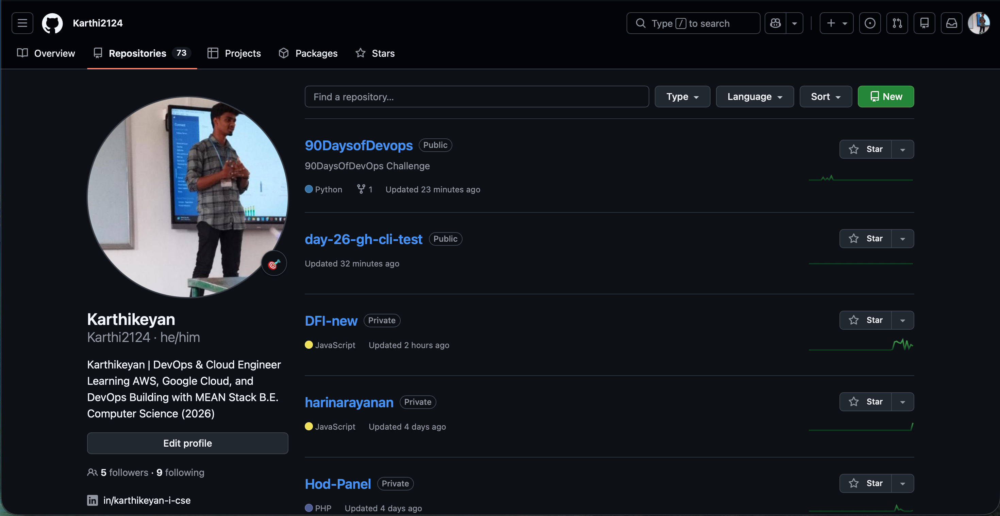

# Day 27 – GitHub Profile Makeover

##  Profile Audit

* Profile picture: Updated to a professional image
* Bio: Added "DevOps Learner | 90 Days of DevOps"
* Pinned repositories: Replaced random repos with meaningful ones
* Repository descriptions: Added clear descriptions

---

##  Profile README Created

Created a special repo with my username and added:

* Introduction
* Current learning journey
* Skills
* Project links
* Contact info

---

##  Repository Organization

### 1. 90 Days of DevOps

* Organized folders by day
* Added README explaining challenge

### 2. shell-scripts

* Added scripts from Day 16–21
* README with script descriptions

### 3. python-scripts

* Added scripts from Day 7–15
* Documented each script

### 4. devops-notes

* Added git commands
* Added shell cheat sheet
* Organized by topics

---

##  Pinned Repositories

Selected best 6 repos:

* 90-days-of-devops
* shell-scripts
* python-scripts
* devops-notes
* (add 2 more meaningful ones)

---

##  Cleanup

* Deleted unused repositories
* Renamed unclear repo names
* Checked for secrets (no API keys exposed)

---

##  Before & After

---

##  Improvements

1. Improved clarity → recruiter can understand my work easily
2. Organized repos → shows structured learning
3. Added README → gives professional impression

---
