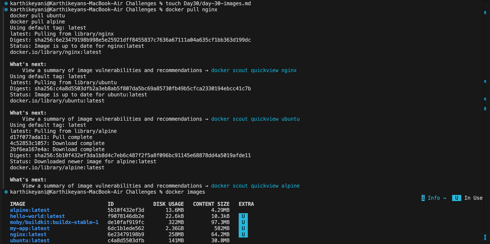
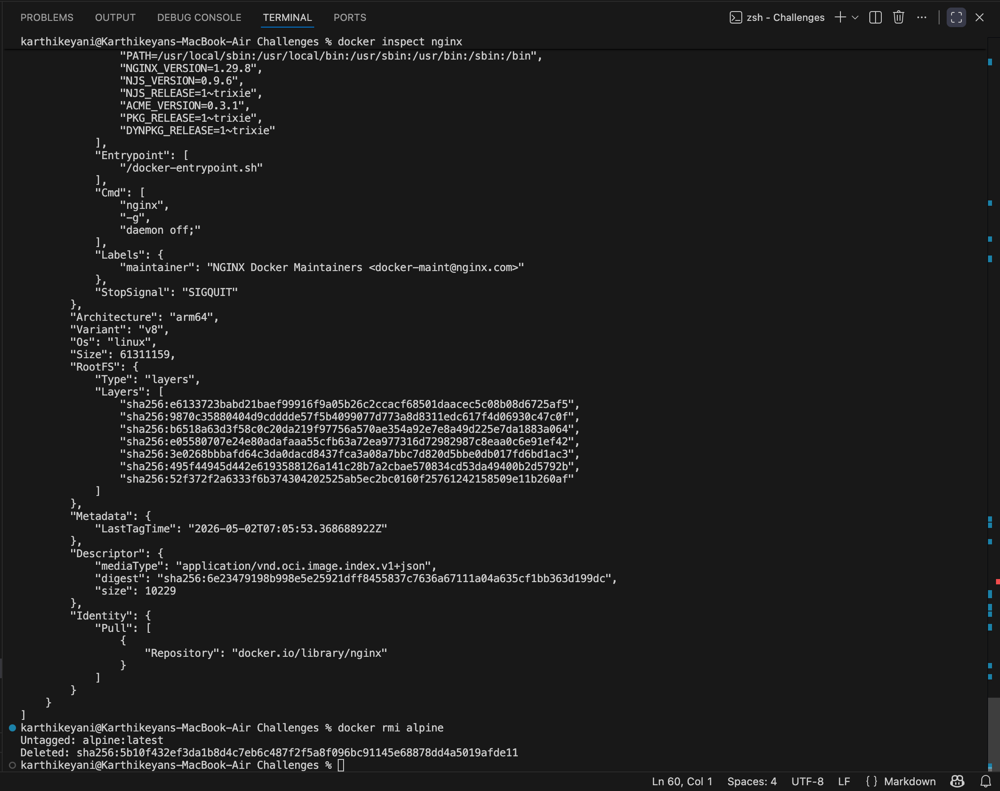
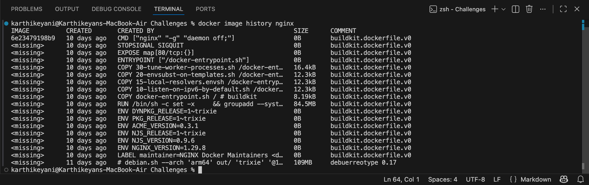
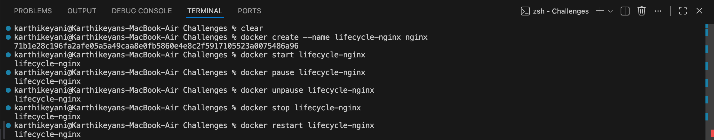

# Day 30 – Docker Images & Lifecycle

##  Docker Images

* Images are read-only templates
* Containers are running instances of images

### Ubuntu vs Alpine

* Ubuntu → large, full OS
* Alpine → lightweight, minimal

---

##  Image Layers

* Images are built in layers
* Each layer is cached
* Layers improve speed and reuse
* 0B layers = metadata only

---

##  Container Lifecycle

Created → Started → Paused → Running → Stopped → Removed

---

##  Working with Containers

* docker run → create + start
* docker exec → run inside container
* docker logs → view logs
* docker inspect → detailed info

---

##  Cleanup

* docker stop → stop containers
* docker rm → remove containers
* docker image prune → clean images
* docker system df → disk usage

---

##  Key Learning

* Images = blueprint
* Containers = execution
* Layers = efficiency
* Lifecycle = full control over containers

---

## Task - 1

## Task - 2 

## Task - 3 

