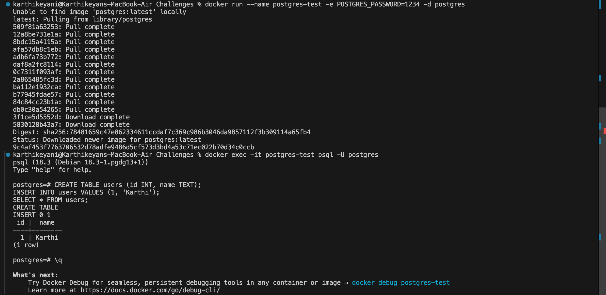

# Day 32 – Docker Volumes & Networking

##  Goal
Understand:
- Data persistence using volumes
- Difference between bind mounts and volumes
- Container communication using Docker networks

---

##  Task 1: The Problem (Ephemeral Containers)

## Task 1: The Problem

I created a Postgres container and added a table with one row.

After stopping and removing the container, I created a new container and checked for the data.

Result:
The table and data were not present.

Reason:
Docker containers are ephemeral. The data is stored inside the container filesystem, and when the container is removed, the data is permanently deleted.
docker run --name postgres-test -e POSTGRES_PASSWORD=1234 -d postgres

